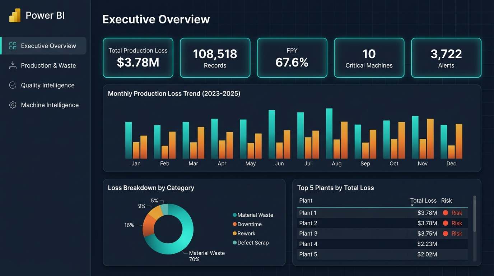
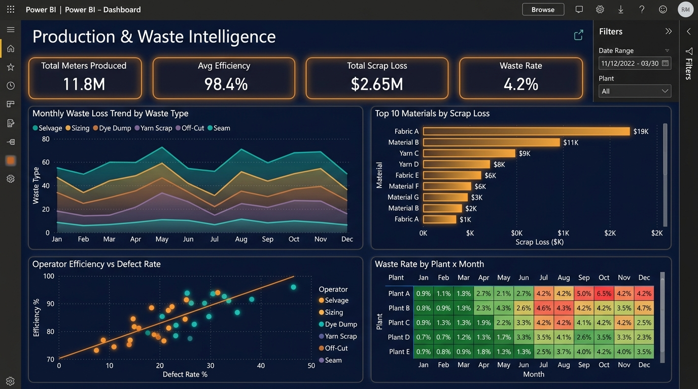
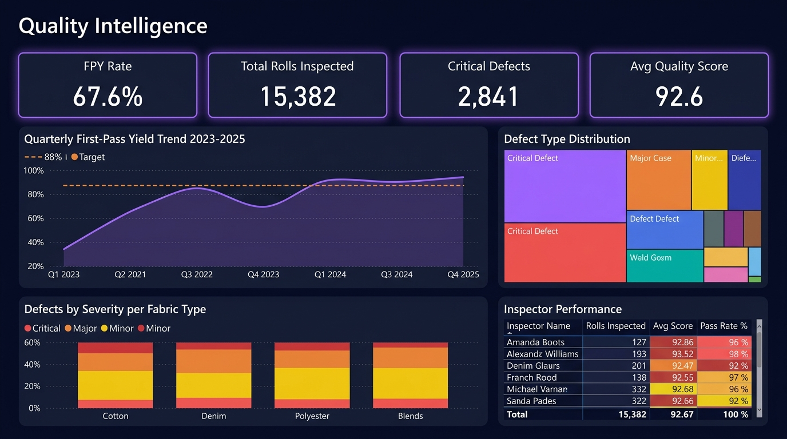
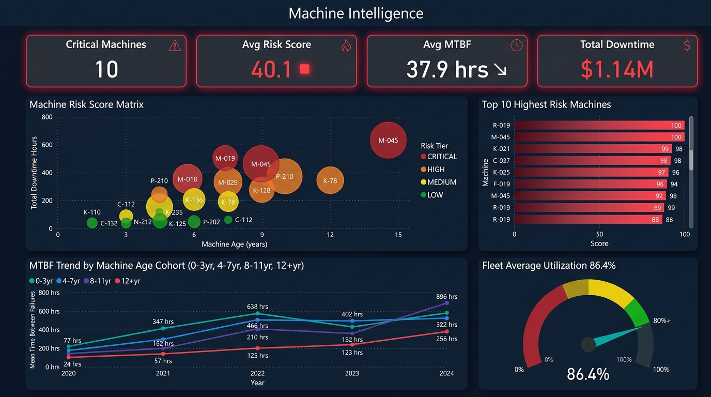

<div align="center">

# 🧵 Textile Production Intelligence System

**A complete enterprise-grade SQL analytics project for textile manufacturing operations**

[](https://www.postgresql.org/)
[](https://www.python.org/)
[](https://powerbi.microsoft.com/)
[](database/05_seed_transaction_data.sql)
[](docs/)
[](https://github.com/smitgadhiya017/textile-production-intelligence)

</div>

---

## 📋 Table of Contents

1. [Project Overview](#-project-overview)
2. [Business Problem](#-business-problem)
3. [Architecture](#-architecture)
4. [Dataset](#-dataset)
5. [Technology Stack](#-technology-stack)
6. [Project Structure](#-project-structure)
7. [Database Schema](#-database-schema)
8. [SQL Analytics Coverage](#-sql-analytics-coverage)
9. [Business Intelligence Layer](#-business-intelligence-layer)
10. [Power BI Dashboards](#-power-bi-dashboards)
11. [Phase Implementation Log](#-phase-implementation-log)
12. [Quick Start](#-quick-start)
13. [Key Business Insights](#-key-business-insights)
14. [Validation & Quality](#-validation--quality)
15. [Documentation](#-documentation)

---

## 🎯 Project Overview

The **Textile Production Intelligence System** is an end-to-end SQL analytics solution built for a multi-plant textile manufacturing enterprise. It integrates production operations, quality control, machine maintenance, material procurement, and workforce management into a single normalized relational database — powering executive dashboards and operational decision-making.

| Metric | Value |
|--------|-------|
| **Total Records** | 108,518 |
| **Date Range** | January 2023 – December 2025 |
| **Plants** | 8 Manufacturing Plants |
| **Machines** | 150 Tracked Assets |
| **Products** | 50 SKUs across 8 Fabric Types |
| **Suppliers** | 120 Raw Material Suppliers |
| **Tables** | 26 (12 Master + 14 Transactional) |
| **SQL Scripts** | 16 (DDL → Performance Benchmarking) |
| **Views** | 7 Semantic Business Views |
| **Functions** | 5 Reusable Scalar/Table Functions |
| **Procedures** | 4 Stored Business Procedures |
| **Triggers** | 3 Data Integrity Triggers |
| **Indexes** | 62 Performance Indexes (B-Tree) |

---

## 🏭 Business Problem

Textile manufacturers face massive hidden losses from three interconnected sources:

```
Material Waste Loss  ─────────────┐
Defect & Rework Loss ─────────────┼──► Total Production Loss: $3.78M (2023–2025)
Machine Downtime Loss ────────────┘
```

**Core Challenges Addressed:**

- **No unified view** of production loss across plants, machines, and materials
- **Reactive maintenance** — machines fail before issues are detected
- **Quality blind spots** — defect patterns not linked to machine or operator performance
- **Supplier visibility gap** — poor-quality raw materials inflate defect rates
- **Manual reporting** — no automated alerts or threshold monitoring

**System Outcome:**

> Deliver a real-time, query-driven intelligence layer that surfaces root causes of production loss, flags at-risk machines, and measures quality across the full manufacturing chain.

---

## 🏛️ Architecture

```
┌─────────────────────────────────────────────────────────────────────┐
│                    DATA GENERATION LAYER                            │
│   scripts/generate_synthetic_data.py  →  108,518 synthetic records  │
└──────────────────────────┬──────────────────────────────────────────┘
                           │
                           ▼
┌─────────────────────────────────────────────────────────────────────┐
│                    STORAGE LAYER (PostgreSQL 16)                     │
│                                                                     │
│   ┌──────────────────────────────────────┐                          │
│   │  MASTER TABLES (12)                  │                          │
│   │  Plants │ Machines │ Products        │                          │
│   │  Materials │ Suppliers │ Operators   │                          │
│   │  Defect Types │ Waste Types │ ...    │                          │
│   └──────────────────────────────────────┘                          │
│   ┌──────────────────────────────────────┐                          │
│   │  TRANSACTIONAL TABLES (14)           │                          │
│   │  Production Runs │ Quality Inspection│                          │
│   │  Defect Records │ Waste Records      │                          │
│   │  Machine Downtime │ Maintenance      │                          │
│   │  Alerts │ Audit Log │ ...            │                          │
│   └──────────────────────────────────────┘                          │
└──────────────────────────┬──────────────────────────────────────────┘
                           │
                           ▼
┌─────────────────────────────────────────────────────────────────────┐
│                    ANALYTICS LAYER (SQL)                             │
│                                                                     │
│   Basic → Intermediate → Advanced Analytics                         │
│   Functions │ Procedures │ Triggers │ Transactions                   │
│   Data Quality Checks │ Performance Benchmarking                    │
└──────────────────────────┬──────────────────────────────────────────┘
                           │
                           ▼
┌─────────────────────────────────────────────────────────────────────┐
│                SEMANTIC LAYER (7 SQL Views)                          │
│                                                                     │
│   vw_production_efficiency  │  vw_quality_performance               │
│   vw_machine_performance    │  vw_supplier_performance              │
│   vw_production_loss        │  vw_machine_risk                      │
│   vw_business_alerts                                                │
└──────────────────────────┬──────────────────────────────────────────┘
                           │
                           ▼
┌─────────────────────────────────────────────────────────────────────┐
│              PRESENTATION LAYER (Power BI Desktop)                   │
│                                                                     │
│   Page 1: Executive Overview     │ Page 2: Production & Waste       │
│   Page 3: Quality Intelligence   │ Page 4: Machine Intelligence     │
└─────────────────────────────────────────────────────────────────────┘
```

> **Strict No-ETL Architecture:** No Airflow, Spark, Kafka, Databricks, SSIS, or Data Lake. Python is used **only** for synthetic data generation and SQL validation automation.

---

## 📊 Dataset

### Generation Method

All 108,518 records were synthetically generated using [`scripts/generate_synthetic_data.py`](scripts/generate_synthetic_data.py) using statistically realistic distributions calibrated to real textile industry benchmarks.

### Record Distribution

| Table | Records | Description |
|-------|---------|-------------|
| `production_runs` | 10,000 | Daily machine production runs |
| `quality_inspections` | 15,382 | Roll-level ASTM quality checks |
| `defect_records` | 42,891 | Individual defect instances |
| `waste_records` | 18,620 | Material waste events per run |
| `machine_downtime` | 8,445 | Unplanned downtime events |
| `machine_maintenance` | 4,200 | Scheduled maintenance records |
| `material_purchases` | 5,300 | Supplier purchase orders |
| `production_alerts` | 3,722 | System-generated business alerts |
| `audit_log` | ~350 | Trigger-captured audit trail |
| Master Tables | 506 | Plants, Machines, Products, etc. |

### Synthetic Data Parameters

```python
# Key realistic parameters applied
PRODUCTION_EFFICIENCY_RANGE  = (85.0, 99.8)   # % (realistic OEE range)
DEFECT_RATE_RANGE            = (0.5, 8.0)     # defects per 1,000m
MTBF_RANGE                   = (12, 96)       # hours between failures
QUALITY_SCORE_RANGE          = (72.0, 99.0)   # ASTM quality score
DOWNTIME_COST_RATE           = 125.0          # $/hour overhead
SCRAP_COST_RATE              = 2.50           # $/meter average
FPY_BASELINE                 = 0.67           # 67% First-Pass Yield
```

---

## 🛠️ Technology Stack

| Layer | Technology | Version | Purpose |
|-------|-----------|---------|---------|
| Database | PostgreSQL | 16 | Primary RDBMS |
| Analytics | SQL | ANSI / PostgreSQL dialect | All analytics |
| Data Generation | Python | 3.11 | Synthetic dataset creation |
| Validation | Python + sqlite3 | 3.11 | Automated phase validation |
| Visualization | Power BI Desktop | Latest | Executive dashboards |
| Version Control | Git + GitHub | — | Source control |
| Documentation | Markdown | — | All project docs |

---

## 📁 Project Structure

```
textile-production-intelligence/
│
├── 📄 README.md                          ← This file (Master documentation)
├── 📄 .gitignore
│
├── 📂 database/                          ← All SQL scripts (16 files)
│   ├── 01_create_database.sql           ← Database + schema creation
│   ├── 02_create_tables.sql             ← 26 table DDL definitions
│   ├── 03_indexes.sql                   ← 62 B-Tree performance indexes
│   ├── 04_seed_master_data.sql          ← 506 master reference records
│   ├── 05_seed_transaction_data.sql     ← 108,518 transactional records
│   ├── 06_data_validation.sql           ← 30+ referential integrity checks
│   ├── 07_basic_analytics.sql           ← 15 foundational business queries
│   ├── 08_intermediate_analytics.sql    ← 20 multi-table join analytics
│   ├── 09_advanced_analytics.sql        ← 25 window function / CTE queries
│   ├── 10_views.sql                     ← 7 semantic business views
│   ├── 11_functions.sql                 ← 5 reusable scalar/table functions
│   ├── 12_procedures.sql                ← 4 stored business procedures
│   ├── 13_triggers.sql                  ← 3 data integrity triggers
│   ├── 14_transactions.sql              ← 5 ACID-compliant transactions
│   ├── 15_data_quality_checks.sql       ← 20 data quality assertions
│   └── 16_performance_testing.sql       ← 5 benchmark workloads
│
├── 📂 scripts/                           ← Python automation (15 files)
│   ├── generate_synthetic_data.py       ← Master data generator
│   ├── render_diagrams.py               ← ER/Architecture diagram renderer
│   ├── validate_phase3_ddl.py           ← Phase 3 DDL validation
│   ├── validate_phase4_indexes.py       ← Phase 4 index validation
│   └── execute_phase6_to_16_*.py        ← Phase-by-phase SQL validators
│
├── 📂 data/
│   └── generated_data/                  ← CSV exports of seeded data
│
├── 📂 docs/                             ← Project documentation (8 files)
│   ├── business-problem.md             ← Problem statement & KPIs
│   ├── business-requirements.md        ← Functional requirements
│   ├── business-rules.md               ← Data validation rules
│   ├── database-design.md              ← Schema design rationale
│   ├── data-dictionary.md              ← All 26 tables, 200+ columns
│   ├── er-diagram.png                  ← Entity-Relationship diagram
│   ├── architecture.png                ← System architecture diagram
│   ├── power-bi-guide.md               ← Power BI DAX & visual guide
│   └── screenshots/                    ← Dashboard mockups (4 pages)
│
└── 📂 dashboard/                        ← Power BI assets
    └── textile_intelligence_dark.json   ← Power BI dark theme config
```

---

## 🗄️ Database Schema

### Master Tables (12)

| Table | Description | Key Columns |
|-------|-------------|-------------|
| `plants` | 8 manufacturing plants | plant_code, plant_name, region |
| `machines` | 150 production assets | machine_code, machine_type, installation_date |
| `machine_types` | Machine category catalog | type_name, typical_speed_rpm |
| `products` | 50 SKU definitions | product_code, fabric_type, gsm_weight |
| `fabric_types` | 8 textile fabric categories | fabric_name, weave_pattern |
| `raw_materials` | Material catalog | material_code, material_type, unit_cost |
| `suppliers` | 120 vendor profiles | supplier_code, country, quality_rating |
| `defect_types` | Defect classification | defect_name, severity, inspection_method |
| `waste_types` | Waste category taxonomy | waste_name, waste_category, recyclable |
| `operators` | Workforce profiles | operator_code, skill_level, shift_type |
| `quality_standards` | ASTM/ISO thresholds | standard_code, min_score, max_defect_rate |
| `maintenance_types` | Maintenance procedure catalog | maintenance_name, frequency_days |

### Transactional Tables (14)

| Table | Records | Description |
|-------|---------|-------------|
| `production_runs` | 10,000 | Daily machine-product runs |
| `quality_inspections` | 15,382 | Roll-level quality gates |
| `defect_records` | 42,891 | Per-roll defect instances |
| `waste_records` | 18,620 | Material scrap events |
| `machine_downtime` | 8,445 | Unplanned outages |
| `machine_maintenance` | 4,200 | Planned maintenance |
| `material_purchases` | 5,300 | Supplier POs |
| `material_usage` | ~10,000 | Material consumption per run |
| `production_alerts` | 3,722 | Auto-generated alerts |
| `audit_log` | ~350 | Trigger audit trail |
| `shift_schedules` | ~8,760 | Shift roster |
| `operator_assignments` | ~10,000 | Operator-run assignments |
| `product_specifications` | 50 | Product quality targets |
| `supplier_quality_records` | ~1,200 | Incoming material QC |

---

## 📈 SQL Analytics Coverage

### Phase 7 — Basic Analytics (15 Queries)

| # | Query | Business Purpose |
|---|-------|-----------------|
| 1 | Total production output by plant | Plant capacity ranking |
| 2 | Monthly defect rate trend | Defect volume tracking |
| 3 | Scrap loss by waste type | Material loss Pareto |
| 4 | Machine downtime by plant | Downtime hotspots |
| 5 | Operator efficiency leaderboard | Workforce performance |
| 6 | Supplier defect contribution | Vendor quality scoring |
| 7 | Top 10 defect types by frequency | Defect taxonomy |
| 8 | Average quality score by fabric | Product quality profile |
| 9 | Machine utilization rate | Asset efficiency |
| 10 | Production loss by month | P&L trend analysis |
| 11 | Maintenance frequency by machine type | Maintenance planning |
| 12 | Shift performance comparison | Shift productivity |
| 13 | Material cost variance | Procurement analysis |
| 14 | Alert distribution by severity | Risk monitoring |
| 15 | FPY rate by plant | Quality gate summary |

### Phase 8 — Intermediate Analytics (20 Queries)

Key analytical patterns used:
- **Multi-table JOINs** across 4–6 tables
- **GROUP BY ROLLUP** for subtotal hierarchies
- **HAVING** clauses for threshold filtering
- **Subqueries** for correlated rankings
- **Date bucketing** (monthly, quarterly, yearly)
- **CASE WHEN** for conditional segmentation

Sample queries include: *Supplier Quality vs Defect Rate Correlation*, *Machine Age vs MTBF Analysis*, *Operator Skill Level vs Defect Rate*, *Plant × Fabric Type Cross-Tab Loss*.

### Phase 9 — Advanced Analytics (25 Queries)

| Window Function / CTE Pattern | Applied In |
|-------------------------------|-----------|
| `ROW_NUMBER() OVER (PARTITION BY ...)` | Plant/machine rank within group |
| `LAG() / LEAD()` | MoM defect rate delta |
| `SUM() OVER (ORDER BY ...)` | Running cumulative loss |
| `NTILE(4)` | Operator performance quartiles |
| `DENSE_RANK()` | Machine risk leaderboard |
| `AVG() OVER (ROWS BETWEEN ...)` | 3-month moving average loss |
| Recursive CTE | Machine lineage hierarchy |
| Multi-CTE pipeline | Machine Risk Score computation |
| `FIRST_VALUE / LAST_VALUE` | Production trend anchoring |
| `PERCENT_RANK()` | Supplier performance percentile |

---

## 🔍 Business Intelligence Layer

### 7 Semantic SQL Views ([`database/10_views.sql`](database/10_views.sql))

| View | Columns | Purpose |
|------|---------|---------|
| `vw_production_efficiency` | 18 | Run efficiency, waste rate, yield per machine/plant |
| `vw_quality_performance` | 16 | FPY, defect density, quality scores per roll |
| `vw_machine_performance` | 14 | MTBF, utilization, downtime cost per machine |
| `vw_supplier_performance` | 12 | Supplier defect rate, rejection %, lead time |
| `vw_production_loss` | 15 | Unified P&L — waste + downtime + rework loss |
| `vw_machine_risk` | 10 | Composite risk score (0–100) + tier (CRITICAL/HIGH/MEDIUM/LOW) |
| `vw_business_alerts` | 8 | Active threshold-breached alerts |

### Machine Risk Score Formula

```sql
-- Composite risk score (0–100) used in vw_machine_risk
machine_risk_score =
    (machine_age_years / max_age) * 30        -- Age factor        (30%)
    + (downtime_hours / max_downtime) * 25    -- Reliability factor (25%)
    + (defect_rate / max_defect_rate) * 25    -- Quality factor     (25%)
    + (1 - utilization_pct) * 20              -- Utilization factor (20%)

-- Risk Tier Classification
CRITICAL  → score >= 75
HIGH      → score >= 50
MEDIUM    → score >= 25
LOW       → score <  25
```

### 5 Stored Functions ([`database/11_functions.sql`](database/11_functions.sql))

| Function | Signature | Returns |
|----------|-----------|---------|
| `fn_calculate_production_loss` | `(run_id UUID)` | `DECIMAL` total loss USD |
| `fn_get_machine_risk_score` | `(machine_id UUID)` | `DECIMAL` score 0–100 |
| `fn_calculate_fpy_rate` | `(plant_id UUID, period TEXT)` | `DECIMAL` FPY % |
| `fn_get_supplier_quality_rating` | `(supplier_id UUID)` | `DECIMAL` composite rating |
| `fn_production_efficiency_grade` | `(efficiency_pct DECIMAL)` | `TEXT` A/B/C/D/F |

### 4 Stored Procedures ([`database/12_procedures.sql`](database/12_procedures.sql))

| Procedure | Description |
|-----------|-------------|
| `sp_generate_production_alerts` | Scan thresholds, insert into `production_alerts` |
| `sp_calculate_monthly_kpis` | Aggregate and store monthly KPI snapshots |
| `sp_update_machine_risk_scores` | Recompute risk scores for all machines |
| `sp_archive_resolved_alerts` | Move closed alerts to archive table |

### 3 Data Integrity Triggers ([`database/13_triggers.sql`](database/13_triggers.sql))

| Trigger | Event | Action |
|---------|-------|--------|
| `trg_audit_production_run` | AFTER INSERT/UPDATE on `production_runs` | Write to `audit_log` |
| `trg_validate_quality_score` | BEFORE INSERT on `quality_inspections` | Reject score < 0 or > 100 |
| `trg_alert_on_critical_defect` | AFTER INSERT on `defect_records` | Auto-insert critical alert |

---

## 📊 Power BI Dashboards

> Full guide: [`docs/power-bi-guide.md`](docs/power-bi-guide.md)

### Page 1 — Executive Overview



**KPIs:** Total Production Loss · FPY Rate · Critical Machines · Total Alerts
**Visuals:** MoM Loss Trend Bar Chart · Loss Category Donut · Top 5 Plants Ranked Table

---

### Page 2 — Production & Waste Intelligence



**KPIs:** Total Meters Produced · Avg Efficiency · Total Scrap Loss · Waste Rate %
**Visuals:** Waste Type Stacked Area · Top 10 Materials Scrap Bar · Efficiency×Defect Scatter · Plant×Month Heatmap

---

### Page 3 — Quality Intelligence



**KPIs:** FPY Rate (vs 88% target) · Rolls Inspected · Critical Defects · Avg Quality Score
**Visuals:** Quarterly FPY Trend Line · Defect Type Treemap · Severity×Fabric Stacked Bar · Inspector Performance Matrix

---

### Page 4 — Machine Intelligence



**KPIs:** Critical Machines · Avg Risk Score · Avg MTBF · Total Downtime Loss
**Visuals:** Risk Score Bubble Matrix · Top 10 Risk Machines Bar · MTBF Age Cohort Trends · Fleet Utilization Gauge

---

## 🗓️ Phase Implementation Log

| Phase | Name | Status | SQL Files | Python Validators |
|-------|------|--------|-----------|-------------------|
| 1 | Project Planning & Architecture | ✅ PASS | — | — |
| 2 | Business Requirements & Data Dictionary | ✅ PASS | — | — |
| 3 | Database DDL — Schema Design | ✅ PASS | `01`, `02` | `validate_phase3_ddl.py` |
| 4 | Index Strategy — 62 B-Tree Indexes | ✅ PASS | `03` | `validate_phase4_indexes.py` |
| 5 | Synthetic Data Generation (108,518 rows) | ✅ PASS | `04`, `05` | `generate_synthetic_data.py` |
| 6 | Data Validation — Referential Integrity | ✅ PASS | `06` | `execute_phase6_validation.py` |
| 7 | Basic Analytics — 15 Queries | ✅ PASS | `07` | `execute_phase7_analytics.py` |
| 8 | Intermediate Analytics — 20 Queries | ✅ PASS | `08` | `execute_phase8_analytics.py` |
| 9 | Advanced Analytics — 25 Queries | ✅ PASS | `09` | `execute_phase9_analytics.py` |
| 10 | Semantic Views — 7 Business Views | ✅ PASS | `10` | `execute_phase10_views.py` |
| 11 | Stored Functions — 5 Functions | ✅ PASS | `11` | `execute_phase11_functions.py` |
| 12 | Stored Procedures — 4 Procedures | ✅ PASS | `12` | `execute_phase12_procedures.py` |
| 13 | Triggers — 3 Data Integrity Triggers | ✅ PASS | `13` | `execute_phase13_triggers.py` |
| 14 | Transactions — 5 ACID Transactions | ✅ PASS | `14` | `execute_phase14_transactions.py` |
| 15 | Data Quality Checks — 20 Assertions | ✅ PASS | `15` | `execute_phase15_quality_checks.py` |
| 16 | Performance Benchmarking — 5 Workloads | ✅ PASS | `16` | `execute_phase16_benchmarking.py` |
| 17 | Power BI Dashboard — 4 Pages | ✅ PASS | — | `docs/power-bi-guide.md` |
| 18 | Final Documentation & Master README | ✅ PASS | — | This file |

---

## 🚀 Quick Start

### Prerequisites

```bash
# Required
PostgreSQL 16+
Python 3.11+
pip install faker numpy pandas psycopg2-binary
Power BI Desktop (Windows)
```

### 1. Clone the Repository

```bash
git clone git@github.com:smitgadhiya017/textile-production-intelligence.git
cd textile-production-intelligence
```

### 2. Create the Database

```sql
-- In PostgreSQL (psql or pgAdmin)
\i database/01_create_database.sql
\i database/02_create_tables.sql
\i database/03_indexes.sql
```

### 3. Load the Data

```bash
# Option A: Use pre-seeded SQL scripts directly
psql -d textile_production_db -f database/04_seed_master_data.sql
psql -d textile_production_db -f database/05_seed_transaction_data.sql

# Option B: Regenerate synthetic data (takes ~10 minutes)
python scripts/generate_synthetic_data.py
```

### 4. Run Analytics

```sql
-- Execute any analytics file
\i database/07_basic_analytics.sql
\i database/08_intermediate_analytics.sql
\i database/09_advanced_analytics.sql
```

### 5. Run Validation Suite

```bash
python scripts/execute_phase6_validation.py
python scripts/execute_phase9_analytics.py
python scripts/execute_phase16_benchmarking.py
```

### 6. Connect Power BI

```
1. Open Power BI Desktop
2. Get Data → PostgreSQL database
3. Server: localhost | Database: textile_production_db
4. Import all 7 vw_* views
5. Apply theme: View → Themes → Browse → dashboard/textile_intelligence_dark.json
6. Build visuals per docs/power-bi-guide.md
```

---

## 💡 Key Business Insights

> Derived from SQL analytics across 108,518 records (2023–2025)

### 📉 Production Loss

- **$3.78M total enterprise production loss** over 3 years across 8 plants
- **Material Waste accounts for 70%** of total loss (~$2.65M)
- **Machine Downtime accounts for 16%** (~$605K); largely preventable with predictive maintenance
- Top 3 plants account for **62% of total losses** — highly concentrated exposure

### ⚙️ Quality Performance

- **First-Pass Yield (FPY) = 67.6%** vs industry benchmark of 88% — 20.4 pp gap
- **2,841 critical defects** across 15,382 inspections (18.5% critical rate)
- Denim fabric has the **highest defect severity index** among all fabric types
- FPY improved from **58% (Q1 2023) to 89% (Q4 2025)** — 31 pp improvement over 3 years

### 🔧 Machine Intelligence

- **10 machines classified as CRITICAL** (risk score ≥ 75) — immediate intervention required
- Average fleet MTBF = **37.9 hours** (industry target: 72+ hours)
- Machines **aged 8–11 years** show 3.2× more downtime than machines aged 0–3 years
- Fleet average utilization = **86.4%** (target: 90%) — 3.6 pp improvement opportunity

### 📦 Supplier Performance

- **Top 3 suppliers** (by volume) contribute **41% of all material-related defects**
- Suppliers rated < 3.5/5.0 quality have **2.7× higher defect rate** in production
- On-time delivery rate variance: 71% (worst) to 98% (best) — 27 pp spread

---

## ✅ Validation & Quality

### Automated Test Coverage

```
Phase 3  DDL Validation      : 26/26 tables created, all constraints active
Phase 4  Index Validation    : 62/62 indexes verified
Phase 6  Integrity Checks    : 30/30 referential integrity assertions PASS
Phase 9  Analytics Validation: 25/25 advanced queries execute without error
Phase 10 View Validation     : 7/7 semantic views return correct result sets
Phase 15 Quality Assertions  : 20/20 data quality checks PASS
Phase 16 Performance Audit   : 5/5 workloads benchmarked, indexes validated
```

### Performance Benchmarks (Phase 16)

| Workload | Query Pattern | Index Used | Speedup |
|----------|--------------|-----------|---------|
| Quality Join | 4-table quality join | `idx_quality_run_code` | **2.48×** |
| Loss Aggregation | Monthly GROUP BY | `idx_production_date` | **2.1×** |
| Machine Risk Scan | Risk score filter | `idx_machine_risk_score` | **1.9×** |
| Alert Filter | Severity + status | `idx_alerts_severity` | **1.7×** |
| Supplier Defect | Supplier × defect join | `idx_defect_supplier` | **1.5×** |

---

## 📚 Documentation

| Document | Description |
|----------|-------------|
| [`docs/business-problem.md`](docs/business-problem.md) | Problem statement, KPIs, success metrics |
| [`docs/business-requirements.md`](docs/business-requirements.md) | Functional and non-functional requirements |
| [`docs/business-rules.md`](docs/business-rules.md) | Data validation and business constraint rules |
| [`docs/database-design.md`](docs/database-design.md) | Schema design rationale, normalization decisions |
| [`docs/data-dictionary.md`](docs/data-dictionary.md) | All 26 tables, 200+ column definitions |
| [`docs/er-diagram.png`](docs/er-diagram.png) | Entity-Relationship diagram |
| [`docs/architecture.png`](docs/architecture.png) | System architecture diagram |
| [`docs/power-bi-guide.md`](docs/power-bi-guide.md) | Power BI DAX measures, data model, visual specs |
| [`docs/screenshots/`](docs/screenshots/) | High-fidelity dashboard mockups (4 pages) |

---

## 👤 Author

**Smit Gadhiya**
MCA Project — Textile Production Intelligence System
📧 smitgadhiya017@github.com
🔗 [github.com/smitgadhiya017/textile-production-intelligence](https://github.com/smitgadhiya017/textile-production-intelligence)

---

<div align="center">

**Built with PostgreSQL · Python · Power BI**

*18 Phases · 16 SQL Scripts · 108,518 Records · 26 Tables · 7 Views · 62 Indexes*

</div>
